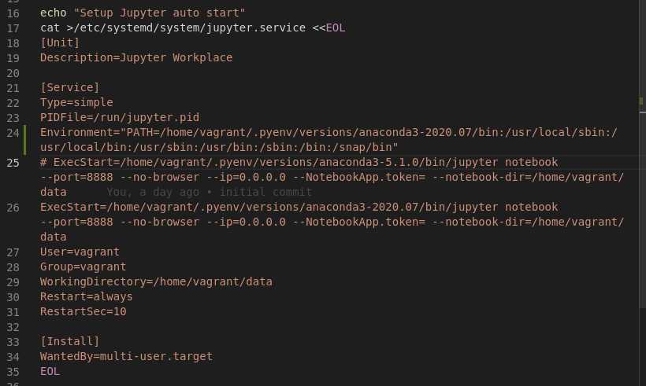
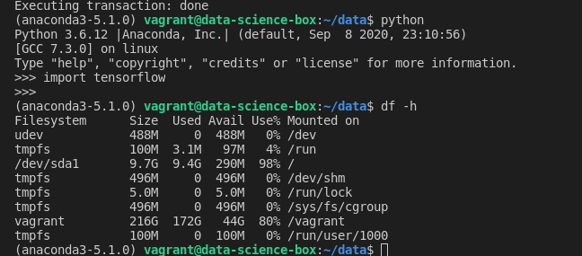

## TODO

* ~~Increase disk size from 10 GB to 20 GB~~
* Is there a way to execute Jupyter server as user? **Answer**: Yes. But it would be a different configuration. An alternative is `jupyterhub`.
* Why shell commands cannot be executed from Jupyter with `!`? Error `/bin/bash: conda: command not found`. **Answer**: Because `jupyter.service` is lacking the path to jupyter binaries in `~/.pyenv/versions/anaconda3-2020.07`. Adding this to the path using `Environment=` should fix it.
* Should we use `pyenv` to install `conda` environments? **Answer**: Both have different objectives. Although `pyenv` is good at managing Python versions and environments, and also is able to install Anaconda Python versions, if we want the full spectrum of `conda` environment commands, we should stick to `conda`.


# 20210116

*   Fix problem with `jupyter.services` and new versions of Anaconda3 installed by `pyenv`. Add path to pyenv binaries using`Environment=` in the configuration file:
    
*   Add some deep learning libraries:
    
*   Disk size increased to 20 GB:
    

# 20210115-night

* Skip installing deep learning packages
* Comment the lines of the VM name to see if this affects running conda from the shell.
# 20210115-day
* Ignore binary `Anaconda3-2020.07-Linux-x86_64.sh` for now.
* Machine needs to increase disk size above 10 GB.
* Change Jupyter server port to 8200.
* Install default R from VM terminal. It installs R-3.4.4 with `sudo apt install r-base`. Need to use another repo for `R-3.5.3` or higher.

* Tried to install `Anaconda3-2020.07-Linux-x86_64.sh` using `pyenv` but it will not work. Cannot install from binary error. `pyenv` only allows a keyword not a binary file as argument.

    ```
    pyenv install Anaconda3-2020.07-Linux-x86_64.sh    # this will not work
    ```

    

    ```
    config.vm.provision "file", source: "Anaconda3-2020.07-Linux-x86_64.sh", destination: "/home/vagrant/Anaconda3-2020.07-Linux-x86_64.sh"
    ```

    

*   Install `plotnine` from script.

*   Installed `tensorflow` and `keras` from provisioning script. Disk space `/dev/sda1 9.7G 6.9G 2.8G 72%`.

*   Install `theano` from the Vagrant provision scripts. Success! Tested with `test_theano.ipynb`.

------

# 20210114-bionic

* Failed installation of `pytorch`. Did not specify CPU only. Used this `conda install pytorch -c pytorch`. For CPU only the installation command should be `conda install pytorch torchvision cpuonly -c pytorch`.

    \* Installing `tensorflow`and `keras`. Disk space after:

    ​    

    \* Disk still 9.7 GB affects installation of many packages.

* Installing `theano`. Disk space after
    

* Installing `tensorflow`and `keras`. Disk space after
    

* Disk still 9.7 GB

* Add shared `notebooks` folder

* Success with new `bionic64` VM built from xenial

* Got message at the end of installation:
    
    
* Use Anaconda3-2020.07 installed with `pyenv`

* Modify the virtualbox VM with `v.name = "vagrant-bi64shsujpy-apyenv2020.07"`

* clone the xenial64 folder to create the base of `bionic64`

* remove symbolic link to vagrant folder/partition

# 20210114-xenial

* Try installing `tensorflow`. Sucess! But it ate up almost all the hard disk space (10 GB)
    
    
* Installing `mxnet`. Failed!
    Disk status after 
    ``/dev/sda1       9.7G  6.5G  3.3G  67% /``
    
    

* Deactivate plugin `vagrant-disksize`. Back to 10 GB disk.
* Try increasing disk size from 10 GB to 20 GB. Crashed the VM. New size is recognized. Using plugin `vagrant-disksize`.
* Installing mxnet on folder data. Success!
    
* Tested installing a different `pyenv` with Anaconda.
* Tested installation of `theano`. Success!
